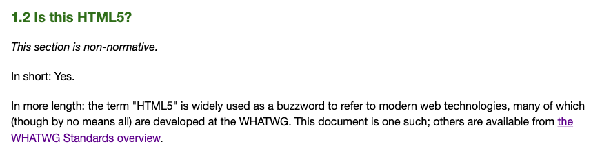
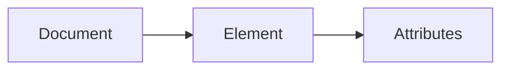
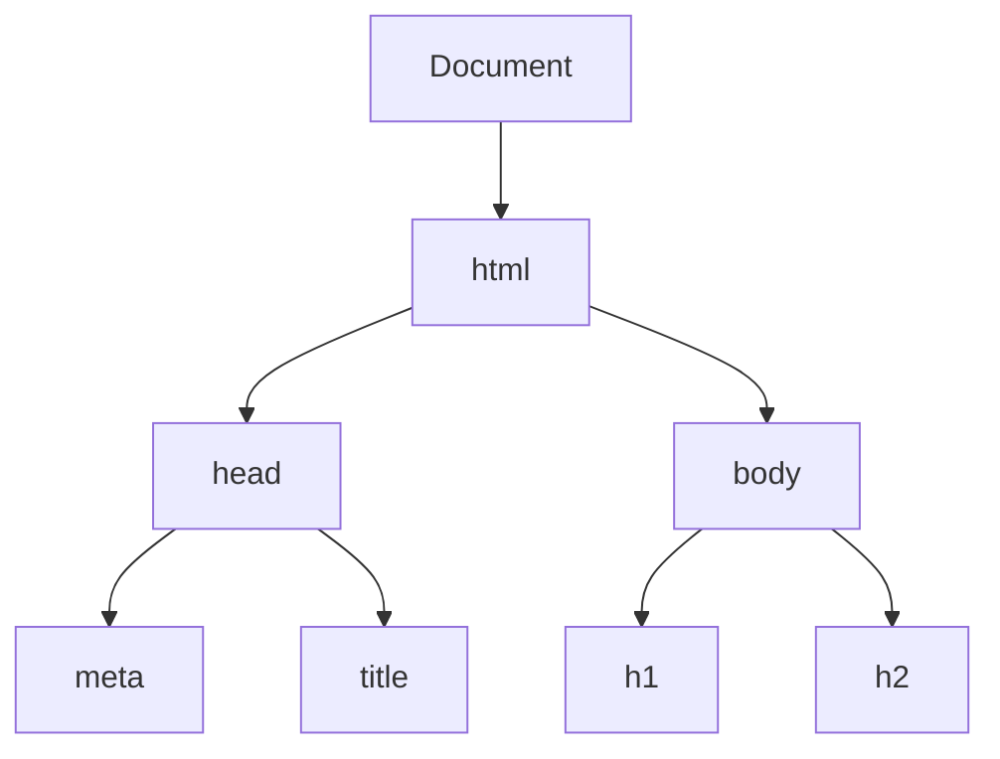

# Introduction to HTML

We will start off with one of the most fundamental piece to the web: HTML. It is one of the most, if not the most, crucial part to a website or web application. For anything to be render on your browser at all, you need a HTML file. In another word, HTML file is your entry point for a website, and that is why it is also the first chapter.

## What is HTML?

HTML stand for **Hypertext Markup Language** which is a markup language used for structuring and presenting content on the World Wide Web.

HTML standard and spec is currently maintained by the Web Hypertext Application Technology Working Group (WHATWG for short). Now, most of you will be more familiar with the term HTML5. But WHATWG called it a bit of a buzzwor and has a bit of a disagreement on it (and you thought we don't have tea in the technical world). Here is what the specification sheet said:



Although it does not really matter at this point, because HTML5 is the last and final version, so there is no point in attaching a version to it anymore. But if you want to know more, feel free to visit the spec sheet link below and scroll to section 1.6 to read the whole story of how our modern HTML came to be.

There are 2 main authorities / resources that you can go to for all you question about HTML:

- [WHATWG](https://html.spec.whatwg.org/multipage/introduction.html#abstract) - This is the spec sheet (it defines how HTML works)
- [World Wide Web Consortium (W3C)](https://www.w3schools.com/html/) - This is the tutorial (it shows how you can use HTML)

If you want to quickly learn how to use some HTML element you can just visit w3schools. If you want to dive deeper, you can read the spec sheet.

## Terminology

We refer to the inner of a HTML file as a **Document**. Usually defined by:

```html
<html></html>
```

A **Document** contained **Elements**. For example, these are some of the common elements:

```html
<a></a>
<li></li>
<div></div>
```
We also refer to the syntax above as tag for ease of communication. So it is an `a tag`, `li tag` and `div tag`. An element need an open tag `<tag>` and a closing tag `</tag>`. So always remember to close off your element.

And each **Elements** contained **Attributes**. For example, these are elements with attributes:

```html
<a href="google.com"></a>
<li class="list-design"></li>
<div id="This is a div"></div>
```

So it looks something like this



The **Document Object Model** or **DOM** refer to a way to model the Document. The DOM structure the HTML as tree of **Nodes**. Each node represent a HTML Element. For example:

```html
<html lang="en">
  <head>
    <meta charset="UTF-8">
    <meta name="viewport" content="width=device-width, initial-scale=1.0">
    <meta http-equiv="X-UA-Compatible" content="ie=edge">
    <title>DOM tree structure</title>
  </head>
  <body>
    <h1>DOM tree structure</h1>
	<h2>Learn about the DOM</h2>
  </body>
</html>
```

The HTML above will be represented as following by the DOM:



In the browser, we have access to a DOM Application Programming Interface (API) which allow you to interact with the HTML using external program (often written in Javascript, but now Web Assembly might a be a new option soon).

Ok that is all you need to know for now for a brief introduction to HTML.


