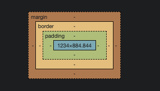

# Major element styling

The same as when we created our HTML file, let's create a new file and name it `index.css` in the same folder. Open up the file and let's start adding style to our HTML.

In this section, we will only concern about major element and won't focus too much on styling that affect each specific sections.

## Container styling

Let's look at the following wrapping element:

```html
<body>
  <div class="container">
    <!-- ... -->
  </div>
</body>
```

If you still remember, in section [1.3. Add Item](../Chapter-1/building-the-body-of-our-app.md), we talk about how some element in HTML will have some default styling applied to them. This is so that if you do not want to use any CSS with your HTML, you can still signal to your users that these are different elements through their default styling. However, in practice, this can cause a lot of confusion.

What we would usually want is to clear all of the default style applied to the element so that we could have a clean slate to work with. This will prevent unwanted presentation that we do not intend for from our HTML.

```css
body {
  margin: 0;
  padding: 0;
}
```

Here we meet two of the probalby most used properties in CSS: `margin` and `padding`. Imagine you have a box as follow:



A simple way to understand `margin` is that it will modify the distance of outside of the box border relative to other object. While `padding` will modify the distance of all the inside element of box relative to its own border.

Next, let give some color to our `background`, some color to our text `color`, and a `font-family` type for our text.

```css
body {
  background: "mistyrose";
  color: #333;
  font-family: Lato, sans-serif;
  margin: 0;
  padding: 0;
}
```

Next, let tried to style our container div:

```css
.container {
  display: block;
  width: 60%;
  margin: 100px auto 0;
}
```
Here, we see the first instance of a class selector. We can see that the element `div` have an attribute `class` of value `container`, so `container` is its class name.

In CSS, there are a few type of `display`. Each element has its own default `display` property so be mindful about this. `display` properties specifies the display behavior of an element. To know more I suggest go and read the [reference sheet](https://www.w3schools.com/cssref/index.php).

## Content styling
```css
h3 {
  color: #333;
  font-weight: 700;
  font-size: 15px;
  border-bottom: 2px solid #333;
  padding: 30px 0 10px;
  margin: 0;
  text-transform: uppercase;
  display: block
}

input {
  margin-right: 1rem;
  font-size: 18px;
  line-height: 18px;
  height: 2rem;
  padding: 10px;
  border: 1px solid #ddd;
  background: #fff;
  border-radius: 6px;
  font-family: Lato, sans-serif;
  color: #888;
}

input:focus-visible,
input:hover {
  outline: transparent;
  border: 1px solid pink;
}

button {
  background: mistyrose;
  border-radius: 1rem;
  padding: 0 1rem;
  margin-left: 1rem;
  height: 2rem;
  cursor: pointer;
}

ul {
  margin: 0;
  padding: 0;
}
```

As there are many properties in this section, we will be going through life in the workshop. Althoug if you did not manage to participate the workshop, you can slowly type all of this properties in your css and see how it affects your HTML in real time. For more specific detail, please refer to the [refence sheet](https://www.w3schools.com/cssref/index.php).

One thing to notices here is the appearance of `:pseudo-class`. `:focus-visible` and `:hover` are two specific state that the input element can take.

`:focus-visible` is the state in which the user is focusing on the input, making it typable.

`:hover` is the state in which the user is hovering their mouse over the element.

