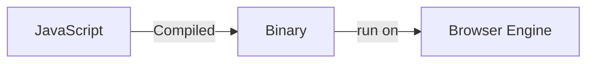

# Introduction to JavaScript

## What is Javascript?

Javascript, or often known by its street name: JS, is the programming language that is at the core of the modern consumer web technology. Different from CSS and HTML, JS is an actual programming language and not a static schema to define a website structure.

In 1995, with the helps of a copius amount of coffee and sleepless night, Brendan Eich, the father of JavaScript created Mocha, a programming language for the web, in 10 days. Mocha would soon grow to become JavaScript, the programing language that we all know and *maybe* "love" today. Mocha was born taken inspiration from Scheme which is a dialect of Lisp, a very very big cornerstone programming language in the world of computer science. 

Then, why was Mocha renamed as JavaScript? As we have come to realised throughout this workshop, when something is named as something it is not, there is only one explanation: **MARKETING**.

Back then Java was really really hot, so as a normal course of action, Netscape - the company that hired Brendan to created Mocha - renamed it to JavaScript in the hope of inspiring adoption and hype, although the language has absolutely zero connection to Java.

Some of you might have heard people call JavaScript as ECMAScript, this is not wrong, but not entirely correct either. ECMAScript is the standard on which JavaScript is based on. As per our routine, here is the specsheet for Javascript:
- [14th edition, 2023](https://262.ecma-international.org/14.0/)
- [Draft, 2024](https://tc39.es/ecma262/)
- [Draft, 2024 ECMAScript API](https://tc39.es/ecma402/)

I want to make it clear that, this is for knowing purpose, most people are not expected to be able to read this specsheet (although if you could, mad respect to you, and what are you doing in this workshop?) For a more pleasant time, please visit MDN instead for Javascript related question:
- [MDN](https://developer.mozilla.org/en-US/docs/Web/JavaScript)

## How does JavaScript works?



JavaScript is a Just In-time Compilation (JIT) language. You can search more on your own what does that means, but essentially it is a compiled language, meaning that it needs to run through a process in which it goes through a Compiler that read all the instruction written by us and then translated it into binary format.

The binary would then be fed into your Browser Javascript Engine (in which different type of browser will have different Javascript engine built for them) and run accordingly. This is why, although most of the time the functionality between all Javascript engine is mostly the same, there could be very very small chance of some Javascript code works just fine in one browser, but not in the other.

The JS file is called through the html file `script` element:

```html
<script type="text/javascript" src="index.js"></script>
```

But if you just want to quickly add some javascript to your html without having to send down another js file, you can actually write and in-line script as follow:


```html
<script>
  console.log("Hi this is an example of JS code in HTML")
</script>
```

When you open up your web browser console, you will see a log that say:

> Hi this is an example of JS code in HTML

## Basic syntax

Here, we will just quickly cover some basic Javascript syntax just for your reference.

To declare a variable, we can do:

```js
var foo = 1;
let bar = "Hello, I am bar";
const foobar = "I am a const, and cannot be reassigned, but can be modified"
```

To decalre a function, we can do:
```js
function foo(variable1, variable2) {
  console.log("This is a function with", variable1, variable2);
}
```

To decalre a function with no name (an annonymous function), we can do:
```js
(var) => { 
  // something to do here
}

// OR

var => {} // if there is only 1 variable
```

To access a properties of an object, we can do:

```js
var randomObject = {
  property1: 1,
  property2: "This is property 2",
}

console.log(randomObject.property1) // 1
console.log(randomObject.property2) // "This is property 2"
```

Don't worry about all the smaller detail for now, it is just a matter of practice. Because if you can manage to learn everything about JS in one workshop, we wouldn't need a workshop to begin with, and I would have to reconsider what have I been doing for the past 3 years or so 😔.
