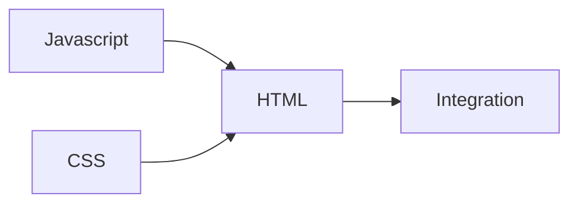

# Overview

This workshop will be splitted into 4 main section:
- Chapter 1: [HTML](./html.md)
- Chapter 2: CSS
- Chapter 3: JavaScript
- Chapter 4: Integration

Each section will take about 20 to 30 minutes to go through. Here is what the project you build will look like at the end of the workshop: 
<a href="https://edic-nus.github.io/Basic-HTML-CSS-and-JS/" target="_blank">Demo</a>
and here is the codebase:
<a href="https://github.com/edic-nus/Basic-HTML-CSS-and-JS" target="_blank">Codebase</a>

And here is sort of a breakdown of how the chapter connect together (I know it does not really coincide with the chapter number, but you will soon see why):

Our objective is simple: Build a basic To Do List using just HTML, CSS and JavaScript. Although it sounds simple, but I promise you there is a lot more under the hood than it seems. Trust me, it is never as straightforward as it seems.

## What is my assumption for you

I think it would be safe to assume that if you sign up for this workshop, you are somewhat new in the world of web dev and more specifically frontend dev which involves the development of the UI portion of a website or web applications.

I <ins><b>don't have any particular assumptions about your skill levels</b></ins> as this should be a course that anyone can just pick up and learn something new. So no worry, and just have fun.

## What are you supposed to learn at the end of the workshop?

Well hopefully something LOL.

But in more detailed, by the end of the workshop, you should be able to:
- Know what is HTML, CSS and Javascript?
- Know some basic HTML element
- Create a basic HTML template
- Know some basic CSS syntax and how they affect the HTML element
- Know what is the DOM?
- Programme some basic Javascript
- Manipulate HTML element with Javascript (JS)
- Use some basic dev tools provided by your native browser to inspect HTML element

Alright if you are ready, let get right into the fun part!